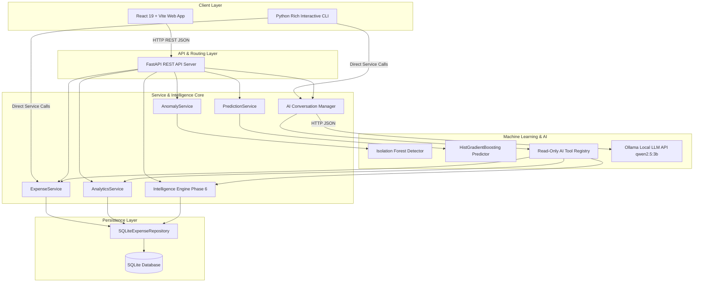

# Expense Tracker & AI Intelligence Platform

An enterprise-grade, production-hardened **Full-Stack Expense Tracker and AI Intelligence Platform** built with Python and React. Features a clean layered architecture, SQLite persistence, machine learning (Isolation Forest anomaly detection & HistGradientBoosting time-series spending forecasting), a Phase 6 deterministic Behavioral Intelligence Engine, local LLM integration via Ollama with read-only function calling guardrails, a FastAPI REST API, a modern React + Vite + Tailwind Web UI, and an interactive CLI application.

---

## System Architecture



---

## Tech Stack Overview

| Category | Component / Technology | Description |
| :--- | :--- | :--- |
| **Frontend Web App** | React 19, TypeScript, Vite 8, Tailwind CSS v4, Lucide Icons | Responsive interactive dashboard, anomaly view, intelligence metrics & dark theme |
| **Backend REST API** | FastAPI, Uvicorn, Pydantic v2 | High-performance asynchronous RESTful API with structured CORS & error handles |
| **CLI Application** | Python 3.10+, Rich Terminal Toolkit | Colorized, menu-driven command line interface with instant feedback |
| **Core Architecture** | Layered Repository Pattern, Dependency Injection | Decoupled domain logic, custom typed exception hierarchy, parameterized SQL |
| **Database** | SQLite 3 with custom Connection Context & PRAGMA safety | Thread-safe connection context manager, foreign keys & WAL mode enabled |
| **Machine Learning** | `scikit-learn`, `pandas`, `numpy`, `joblib` | Isolation Forest for anomaly scoring & HistGradientBoosting for spend forecasting |
| **Behavioral Intelligence** | Phase 6 Engine (9 Core Deterministic Analyzers) | Profile analysis, auto-budgeting, recurring/subscriptions, habit skew, MoM trends |
| **AI Assistant** | Ollama (Qwen 2.5:3b), Custom Tool Guardrails | Natural language query interface enforcing read-only data access limits |
| **Testing & Tools** | `pytest`, `oxlint`, `ruff` | Comprehensive unit/integration test suite, code linting & diagnostic scripts |

---

## Directory Structure

```text
Expense_Tracker/
│
├── app/                           # Core Application Layer & Domain Services
│   ├── config/                    # Settings & Environment Configuration
│   │   ├── __init__.py
│   │   └── settings.py
│   ├── database/                  # Connection context manager & PRAGMA initialization
│   │   ├── __init__.py
│   │   ├── connection.py
│   │   └── initialization.py
│   ├── exceptions/                # Typed Custom Exception Hierarchy
│   │   ├── base.py, database.py, validation.py, service.py, ml.py, ai.py
│   ├── models/                    # Domain Data models (Expense dataclass)
│   │   └── expense.py
│   ├── repositories/              # Repository Layer (Interface & SQLite Implementation)
│   │   ├── base.py
│   │   └── expense_repository.py
│   ├── services/                  # Core Business Logic & Phase 6 Intelligence
│   │   ├── expense_service.py
│   │   ├── analytics_service.py
│   │   ├── anomaly_service.py
│   │   ├── prediction_service.py
│   │   ├── profile_service.py
│   │   ├── budget_service.py
│   │   ├── recurring_service.py
│   │   ├── habit_service.py
│   │   ├── trend_service.py
│   │   ├── category_prediction_service.py
│   │   ├── scenario_service.py
│   │   └── insights_service.py
│   ├── utils/                     # Centralized Validation, Date, & Number Utilities
│   │   ├── dates.py, numbers.py, validation.py
│   ├── ai/                        # AI Assistant Engine & Tool Guardrails
│   │   ├── llm.py, prompts.py, registry.py, tools.py, memory.py, conversation.py
│   └── cli/                       # CLI Application UI & Formatting
│       ├── app.py, menus.py, commands.py, formatting.py
│
├── backend/                       # FastAPI Web API Server
│   └── app/
│       ├── api/                   # API Route Controllers
│       │   ├── expenses.py, analytics.py, intelligence.py, ml.py, ai.py, health.py
│       ├── schemas/               # Pydantic Schemas for DTOs
│       ├── deps.py                # FastAPI Dependency Injection
│       └── main.py                # FastAPI App Entry Point
│
├── frontend/                      # Modern React + Vite Web UI
│   ├── src/
│   │   ├── api/                   # Axios API Clients
│   │   ├── components/            # Reusable UI components & Navbar/Sidebar
│   │   ├── pages/                 # Dashboard, Expenses, Analytics, Intelligence, Anomalies, Predictions, AI
│   │   ├── types/                 # TypeScript interfaces
│   │   ├── App.tsx, main.tsx, index.css
│   ├── package.json, vite.config.ts, tsconfig.json
│
├── ml/                            # Machine Learning Pipeline Engine
│   ├── dataset.py                 # SQLite extraction to pandas DataFrame
│   ├── features.py                # Temporal & lag feature engineering
│   ├── preprocessing.py           # Temporal train/test splitting
│   ├── evaluation.py              # MAE, RMSE, R² evaluation metrics
│   ├── forecasting.py             # Time-series daily aggregation & model training
│   ├── anomaly_detection.py       # Isolation Forest anomaly detector
│   ├── model_manager.py           # Model serialization & validation (joblib)
│   ├── schemas.py                 # Dataclasses & metadata schemas
│   └── models/                    # Trained model artifacts (.joblib, .json)
│
├── scripts/                       # Maintenance & CLI Utilities
│   ├── generate_expenses.py       # Synthetic dataset generator (2,000-5,000+ records)
│   ├── check_ml_dataset.py        # Dataset verification script
│   ├── train_models.py            # Model training & selection pipeline
│   ├── health_check.py            # Diagnostic system health inspector
│   ├── backup_database.py         # Timestamped database backup utility
│   ├── test_ollama.py             # Ollama API connectivity test
│   └── test_ai.py                 # AI tool calling integration check
│
├── tests/                         # Test Suite (Unit & Integration)
│   ├── conftest.py                # Shared pytest fixtures
│   ├── unit/                      # Modular unit tests & edge case suite
│   └── integration/               # Database, API & AI pipeline integration tests
│
├── data/                          # SQLite database & backup storage
├── logs/                          # Rotating log files with secret redaction
├── .env.example
├── pyproject.toml
├── requirements.txt
└── main.py                        # CLI Application Entry Point
```

---

## Key Platform Features

### 1. Expense Management & CRUD
- Add, update, delete, view, search, filter, and paginate expenses.
- Robust input validation for amounts, categories, and dates.
- Database PRAGMA safety and query parameterization.

### 2. Statistical Analytics & Monthly Aggregations
- Total spend calculations, monthly averages, daily averages, and category breakdowns.
- Month-over-Month (MoM) spend comparisons and percentage change tracking.

### 3. Machine Learning Anomaly Detection
- Unsupervised **Isolation Forest** model evaluating statistical outlier metrics.
- Flags unusual spending amounts relative to contextual features and temporal historical baselines.

### 4. Time-Series ML Spending Forecasting
- Auto-regressive **HistGradientBoosting** regression model.
- Predicts daily spending and projects total end-of-month (EOM) cumulative expenditure based on lag and rolling temporal features.

### 5. Phase 6 Advanced Expense Intelligence
- **Personal Spending Profile**: Means, medians, spend volatility classification, transaction sizing, and weekend/weekday splits.
- **Auto-Budget Detection**: Recommended spending limits derived from standard deviation envelopes and historical baselines.
- **Recurring Expense Engine**: Transaction clustering by description cleaning, variance tolerances, and frequency intervals.
- **Subscription Detector**: Digital subscription identifier predicting next renewal dates and annual impact.
- **Behavioral Habits Analysis**: Identifies weekend spending skews, late-month surges, and micro-transaction accumulations.
- **MoM Trend Acceleration Engine**: Regression-based category growth rate calculation highlighting surging spending areas.
- **Category-Level Forecasting**: Category aggregated time-series prediction models.
- **What-If Scenario Simulator**: Simulates potential category savings and projects adjusted annual trajectories.
- **Actionable Insights Engine**: Aggregates anomalies, budgets, habits, and acceleration into unified alert cards.

### 6. Local AI Assistant with Read-Only Guardrails
- Natural language query interface powered by local LLM (`Ollama` / `Qwen 2.5:3b`).
- Enforces strict read-only tool calling guardrails; the LLM cannot execute write operations or raw SQL queries.

### 7. Modern React Web Interface & Rich CLI UI
- **Web UI**: Interactive dashboard with cards, charts, analytics visualizer, intelligence hub, and AI chat view.
- **CLI App**: Formatted menu system using `Rich` for colorized terminal usage.

### 8. System Observability & Hardening
- Log redactor masking secrets/tokens.
- Health check diagnostic tool inspecting DB connectivity, ML artifacts, and Ollama status.
- Timestamped database backup utility.

---

## Quickstart & Installation Guide

### Prerequisites
- **Python**: Version `3.10` or higher
- **Node.js**: Version `18.0` or higher (for Web UI)
- **Ollama**: (Optional, required for local AI assistant features)

---

### Step 1: Repository Setup & Python Environment

```bash
# Clone repository
git clone <repository-url>
cd Expense_Tracker

# Create & activate virtual environment (Windows PowerShell)
python -m venv .venv
.\.venv\Scripts\Activate.ps1

# Install Python dependencies
pip install -r requirements.txt
```

---

### Step 2: Environment Configuration

Copy `.env.example` to `.env`:

```bash
cp .env.example .env
```

---

### Step 3: Run the FastAPI Backend API Server

```bash
uvicorn backend.app.main:app --reload --port 8000
```
- API Documentation (Swagger UI): `http://localhost:8000/docs`
- Health Endpoint: `http://localhost:8000/api/health`

---

### Step 4: Run the React Web UI

In a new terminal:

```bash
cd frontend
npm install
npm run dev
```
- Open your browser to `http://localhost:5173`

---

### Step 5: Run the Interactive CLI Application (Alternative Interface)

If you prefer using the terminal interface:

```bash
python main.py
```

---

## Utility Scripts & Developer Commands

### 1. Run Automated Test Suite
```bash
pytest -v
```

### 2. Run System Health Diagnostics
```bash
python scripts/health_check.py
```

### 3. Generate Synthetic Dataset (2,000–5,000 Records)
```bash
python scripts/generate_expenses.py --records 3500 --months 24
```

### 4. Train Machine Learning Models
```bash
python scripts/train_models.py
```

### 5. Create Timestamped Database Backup
```bash
python scripts/backup_database.py
```

---

## REST API Reference Summary

All endpoints return JSON wrapped in standard `APIResponse(success=True|False, data=..., error=...)`.

| Category | Method | Endpoint | Description |
| :--- | :--- | :--- | :--- |
| **Health** | `GET` | `/api/health` | System health status & diagnostics |
| **Expenses** | `GET` | `/api/expenses` | List/filter expenses with pagination |
| | `POST` | `/api/expenses` | Create a new expense record |
| | `GET` | `/api/expenses/{id}` | Retrieve specific expense by ID |
| | `PUT` | `/api/expenses/{id}` | Update existing expense record |
| | `DELETE` | `/api/expenses/{id}` | Delete expense record |
| **Analytics** | `GET` | `/api/analytics/summary` | General spending summary metrics |
| | `GET` | `/api/analytics/categories` | Spend totals grouped by category |
| | `GET` | `/api/analytics/monthly` | Monthly spend timeline & MoM growth |
| **Intelligence** | `GET` | `/api/intelligence/profile` | Personal spending metrics & volatility |
| | `GET` | `/api/intelligence/budget-recommendations` | Auto-detected budget allocations |
| | `GET` | `/api/intelligence/recurring` | Detected recurring transactions |
| | `GET` | `/api/intelligence/subscriptions` | Detected active subscriptions |
| | `GET` | `/api/intelligence/habits` | Behavioral habit skews & micro-transactions |
| | `GET` | `/api/intelligence/trends` | MoM trend acceleration metrics |
| | `GET` | `/api/intelligence/category-forecasts` | Category-specific time-series projections |
| | `POST` | `/api/intelligence/scenarios/savings` | Simulate what-if scenario projections |
| | `GET` | `/api/intelligence/insights` | Consolidated actionable insight cards |
| **Machine Learning** | `GET` | `/api/ml/anomalies` | Detect spending anomalies (Isolation Forest) |
| | `GET` | `/api/ml/predict/daily` | Predict daily & EOM spend (Gradient Boosting) |
| **AI Assistant** | `POST` | `/api/ai/chat` | Send natural language prompt to Ollama LLM |
| | `GET` | `/api/ai/status` | Check local Ollama daemon status & models |

---

## AI Assistant & Ollama Setup Guide

To enable local LLM assistant interactions (`/api/ai/chat` or option `10` in CLI):

### 1. Download & Install Ollama
Download the official Windows installer from:
👉 **[https://ollama.com/download/windows](https://ollama.com/download/windows)**

### 2. Pull Recommended Local Model (`qwen2.5:3b`)
```bash
ollama pull qwen2.5:3b
```

### 3. Test Ollama Daemon
Ensure Ollama service is active at `http://localhost:11434`:
```powershell
Invoke-RestMethod http://localhost:11434/api/tags
```

### 4. Run AI Diagnostics
```bash
python scripts/test_ollama.py
python scripts/test_ai.py
```

### Troubleshooting Matrix for Ollama

| Symptom / Error | Cause | Solution |
| :--- | :--- | :--- |
| `ollama : The term 'ollama' is not recognized` | Ollama executable not in system PATH | Run Ollama Windows installer from website. Restart terminal. |
| `Ollama API call to 'qwen2.5:3b' unavailable` | Ollama service is stopped | Launch Ollama application from Windows taskbar or execute `ollama serve`. |
| `model 'qwen2.5:3b' not found` | Target model missing locally | Run `ollama pull qwen2.5:3b`. |
| `Connection refused: localhost:11434` | Firewall blocking port or wrong base URL | Confirm `OLLAMA_BASE_URL=http://localhost:11434` in `.env`. |

---

## Security & Architecture Guarantees

1. **SQL Injection Defense**: All repository operations use parameterized SQL queries (`?`).
2. **AI Tool Guardrails**: The LLM engine calls registered read-only python functions. It has zero direct write access to SQLite or code execution privileges.
3. **Secret Redaction**: Logs pass through a custom RedactingFormatter to prevent token leaks.
4. **Model Safety**: ML model artifacts are strictly loaded from trusted builds serialized with `joblib`.

---

## License & Maintenance

Built for Enterprise & Personal Finance Intelligence. Maintained by the Software Architecture Team.
