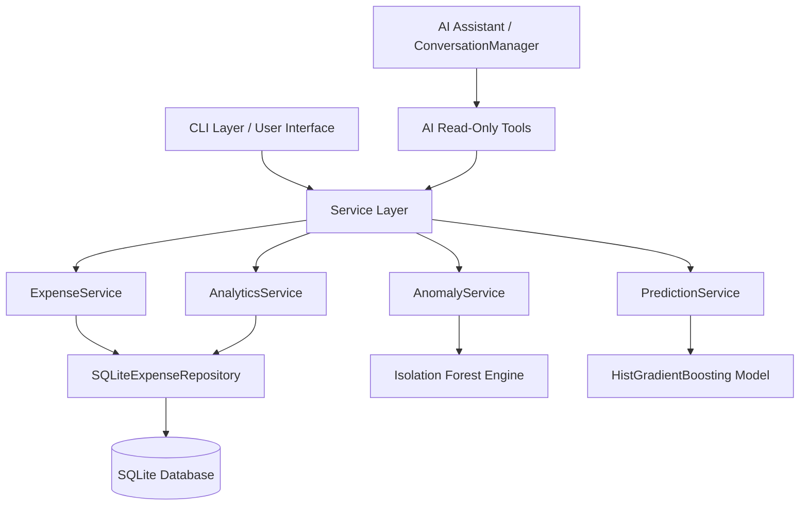

# Expense Tracker & Intelligence System

An enterprise-grade, production-hardened Expense Tracker and AI Intelligence System built in Python. Features clean layered architecture, SQLite persistence, machine learning (Isolation Forest anomaly detection & time-series spending forecasting), local LLM integration via Ollama, read-only AI tool-calling guardrails, and a CLI application.

---

## Architecture Overview



### Module Structure

```text
Expense_Tracker/
│
├── app/                           # Core Application Layer
│   ├── config/                    # Settings & Environment Configuration
│   │   ├── __init__.py
│   │   └── settings.py
│   ├── database/                  # Connection context manager & PRAGMA initialization
│   │   ├── __init__.py
│   │   ├── connection.py
│   │   └── initialization.py
│   ├── exceptions/                # Typed Custom Exception Hierarchy
│   │   ├── __init__.py
│   │   ├── base.py
│   │   ├── database.py
│   │   ├── validation.py
│   │   ├── service.py
│   │   ├── ml.py
│   │   └── ai.py
│   ├── models/                    # Data models (Expense dataclass)
│   │   └── expense.py
│   ├── repositories/              # Repository Layer (Interface & SQLite Implementation)
│   │   ├── base.py
│   │   └── expense_repository.py
│   ├── services/                  # Business Logic Services
│   │   ├── expense_service.py
│   │   ├── analytics_service.py
│   │   ├── anomaly_service.py
│   │   └── prediction_service.py
│   ├── utils/                     # Centralized Validation, Date, & Number Utilities
│   │   ├── dates.py
│   │   ├── numbers.py
│   │   └── validation.py
│   ├── ai/                        # AI Assistant Engine & Tool Guardrails
│   │   ├── llm.py
│   │   ├── prompts.py
│   │   ├── registry.py
│   │   ├── tools.py
│   │   ├── memory.py
│   │   └── conversation.py
│   └── cli/                       # CLI Application UI & Commands
│       ├── app.py
│       ├── menus.py
│       ├── commands.py
│       └── formatting.py
│
├── ml/                            # Machine Learning Engine
│   ├── dataset.py                 # SQLite extraction to pandas DataFrame
│   ├── features.py                # Temporal & lag feature engineering
│   ├── preprocessing.py           # Temporal train/test splitting
│   ├── evaluation.py              # MAE, RMSE, R² evaluation metrics
│   ├── forecasting.py             # Time-series daily aggregation & model training
│   ├── anomaly_detection.py       # Isolation Forest anomaly detector
│   ├── model_manager.py           # Model serialization & validation (joblib)
│   ├── schemas.py                 # Dataclasses & metadata schemas
│   └── models/                    # Trained model artifacts (.joblib, .json)
│
├── scripts/                       # Maintenance & CLI Utilities
│   ├── generate_expenses.py       # Synthetic dataset generator
│   ├── check_ml_dataset.py        # Dataset verification script
│   ├── train_models.py            # Model training & selection pipeline
│   ├── health_check.py            # Diagnostic system health inspector
│   └── backup_database.py         # Timestamped database backup utility
│
├── tests/                         # Test Suite (Unit & Integration)
│   ├── conftest.py                # Shared pytest fixtures
│   ├── unit/                      # Modular unit tests & edge case suite
│   └── integration/               # Database & AI pipeline integration tests
│
├── data/                          # SQLite database & backup storage
├── logs/                          # Rotating log files
├── .env.example
├── pyproject.toml
├── requirements.txt
└── main.py                        # Dependency Injection application entry point
```

---

## Core Features

1. **Expense Management**: Add, view, edit, delete, search, and filter expenses with input validation.
2. **Statistical Analytics**: Aggregations, averages, category breakdowns, monthly spending trends, and month-over-month comparisons.
3. **ML Anomaly Detection**: Unsupervised `Isolation Forest` model identifying statistically unusual expenses.
4. **ML Spending Forecasting**: Time-series `HistGradientBoosting` model predicting daily and monthly spending based on lag and rolling features.
5. **AI Expense Assistant**: Natural-language conversational interface powered by local LLM (`Ollama`).
6. **Strict AI Guardrails**: The LLM calls registered read-only tools and cannot directly modify SQLite or execute arbitrary code.
7. **System Observability & Health**: Logging with secret redaction, diagnostic health check command, and timestamped database backups.

---

## Developer Workflows & Commands

### 1. Installation
```bash
git clone <repository-url>
cd Expense_Tracker
pip install -r requirements.txt
```

### 2. Run Main Application
```bash
python main.py
```

### 3. Run Automated Test Suite
```bash
pytest -v
```

### 4. System Health Check
```bash
python scripts/health_check.py
```

### 5. Create Timestamped Database Backup
```bash
python scripts/backup_database.py
```

### 6. Train Machine Learning Models
```bash
python scripts/train_models.py
```

### 7. Generate Synthetic Dataset (2,000–5,000 records)
```bash
python scripts/generate_expenses.py --records 3500 --months 24
```

---

## AI Assistant Setup (Ollama)

To interact with option `9. AI Expense Assistant`:
1. Ensure [Ollama](https://ollama.com/) is installed and running:
   ```bash
   ollama serve
   ```
2. Pull your model:
   ```bash
   ollama pull qwen3
   ```

---

## Security & Architectural Guarantees

- **No Raw SQL Strings**: All queries use parameterized inputs (`?`) to prevent SQL injection.
- **Read-Only AI Boundary**: AI tools delegate strictly to application services; write operations are disallowed.
- **Secret Protection**: Log output uses a custom redacting formatter to mask tokens/secrets.
- **Trusted Model Sources**: Local ML models are serialized with `joblib`. Ensure model artifacts originate from trusted builds.
